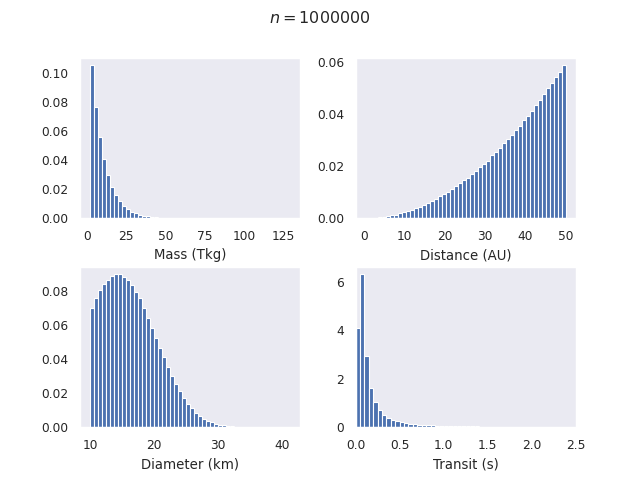
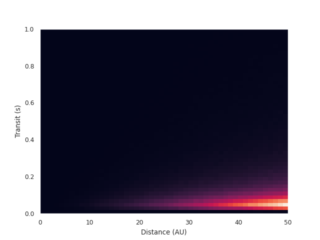

# hooey
Hyperbolic Object Occultation survEY

The basic idea is to watch a patch of sky with lots of stars (e.g. the galactic core, or Omega Cen), and watch for transits. Not exoplanet transits, which might last on the order of minutes. Transits by objects much closer to our solar system. This means transits would be much shorter. Modelling (see `model`) showed that the majority of transit events would be around a tenth of a second, for a (hopefully) reasonable distribtion of objects.

This means you would want a camera with a refresh rate double that. GigE computer vision cameras are designed for such a purpose, lacking only the sensitivity necessary (especially with interline transfer, such as the Prosilica GT 6600C).

As we do not know how widely distributed interstellar objects are, especially those we can not see by traditional methods, it is impossible to know how often an event like this would be observed, so the idea is to maximise your chances, by using large, fast telescopes with short exposure times (very much subsecond), and looking at a dense patch of sky. Modelling to see how short the transit times are lets us know what we expect a telescope to be able to accomplish.
